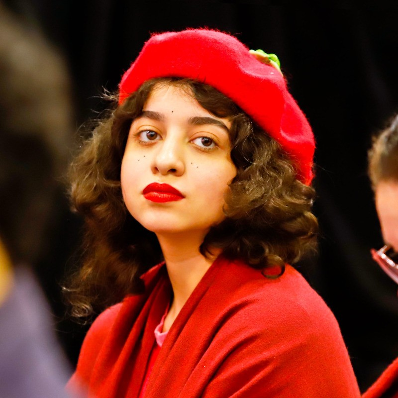

Atuo como pesquisadora multidisciplinar e ativista em Tecnologia Responsável e Governança da Internet desde setembro de 2023, com participação no [C-PARTES](https://instagram.com/coletivo_partes) e no [LAPIN](https://lapin.org.br). Fui bolsista [Youth do CGI.br](https://forumdainternet.cgi.br/pt-BR/youth) em 2020 e 2023, e aluna do [curso intensivo da EGI.br](https://egi.nic.br/) em 2024. Minha pesquisa foca em Internet, IA, tecnovigilância e governança de dados, utilizando minha formação em Ciência da Computação para apoiar a redação de políticas públicas. 

Em 2024, estou pesquisadora na [Cátedra Oscar Sala](http://www.iea.usp.br/pesquisa/catedras-e-convenios/catedra-oscar-sala/titular-catedra/virgilio-almeida/projeto-ia-responsavel) da USP e no [Center for AI and Digital Policy](https://www.caidp.org/global-academic-network/ai-policy-clinic/), onde estudo frameworks de políticas de IA e proponho melhorias para documentos locais. [Saiba mais...](https://www.linkedin.com/in/linasdias/)

Fora do âmbito profissional, gosto de yoga, meditação, [gatos](https://instagram.com/sleepycatlua) e bebidas funcionais.